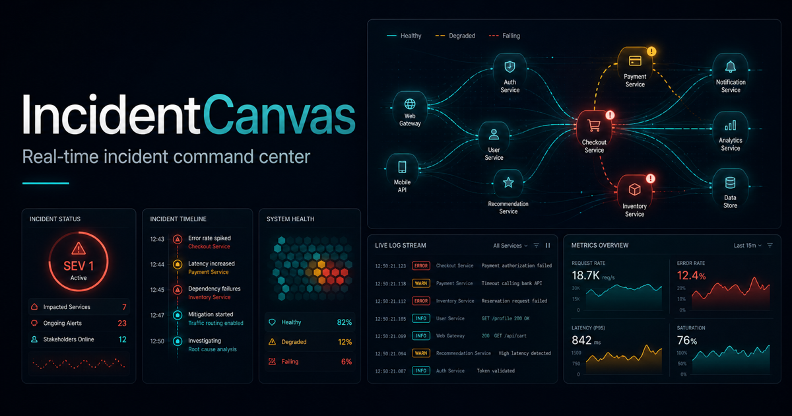
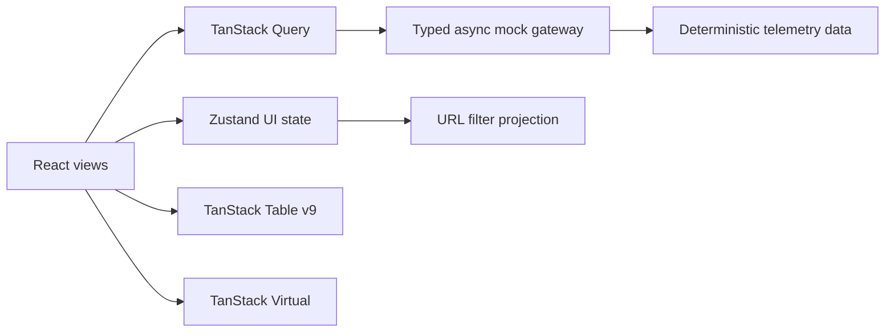

# IncidentCanvas

Frontend command center для расследования production-инцидентов. Один экран
объединяет SLO-метрики, карту зависимостей, incident timeline, сортируемую
историю и виртуализированный поток логов. Проект сфокусирован на архитектуре
сложного React-интерфейса и работе с большим объёмом оперативных данных.

> English overview: an observability workspace built to demonstrate advanced
> frontend engineering — typed query boundaries, explicit client state,
> optimistic mutations, URL-synced filters, table sorting and virtualization of
> a 5,000-row live log stream.

## История проекта

- первоначальная разработка: август — октябрь 2025 года (период указан
  приблизительно);
- подготовка портфолио-версии: сентябрь 2026 года.

Репозиторий содержит актуализированную и документированную версию проекта,
подготовленную для публичного портфолио.



## Что реализовано

- command center активного инцидента с SEV, SLO и affected users;
- интерактивная SVG-карта зависимостей сервисов;
- timeline автоматических сигналов, релизов и действий команды;
- сортируемая таблица инцидентов на TanStack Table v9;
- виртуализированные 5000 строк логов через TanStack Virtual;
- фильтры по уровню, сервису и тексту, синхронизированные с URL;
- React Query для server-state и Zustand для UI-state;
- optimistic update при принятии инцидента с rollback при ошибке;
- live telemetry invalidation и индикатор состояния соединения;
- command palette по `Cmd/Ctrl + K`;
- loading/error states, responsive layout и keyboard navigation;
- детерминированный typed mock API и unit-тесты.

## Стек

React 19, TypeScript 5.9, Vinext, TanStack Query, TanStack Table v9,
TanStack Virtual, Zustand, shadcn/ui, Tailwind CSS, Vitest, Docker.

## Быстрый запуск

### Docker

```bash
cp .env.example .env
docker compose up --build -d
```

Приложение будет доступно на <http://localhost:8070>. Остановка:

```bash
docker compose down
```

### Локальная разработка

Требуется Node.js 22.13+.

```bash
npm ci
npm run dev
```

## Quality gate

```bash
npm run format -- --check
npm run lint
npx tsc --noEmit
npm test
npm run build
```

Тесты проверяют воспроизводимую генерацию большого набора логов, совместную
работу фильтров, optimistic workflow инцидента и переходы Zustand store.

## Архитектура



Подробные решения и путь подключения настоящего observability backend описаны в
[docs/architecture.md](docs/architecture.md).

## Почему два вида состояния

- **React Query** владеет данными, которые в реальном продукте приходят с
  backend: snapshot, incidents и logs.
- **Zustand** хранит локальное состояние рабочего места: активный экран,
  выбранный инцидент, фильтры и command palette.
- URL получает проекцию фильтров, поэтому ссылку на конкретный рабочий контекст
  можно сохранить или отправить коллеге.

## Производительность

В DOM одновременно присутствуют только видимые строки логов плюс overscan, хотя
dataset содержит 5000 элементов. Фильтрация мемоизирована, стабильные table
features и column helper вынесены за пределы render, а telemetry обновляет только
нужный query key.

## Repository map

```text
app/                    screens, providers, design tokens and metadata
components/ui/          reusable shadcn primitives
lib/mock-api.ts         typed async data boundary and telemetry source
lib/store.ts            Zustand UI state
tests/                  unit tests for data and state behavior
docs/architecture.md    decisions, data flow and production evolution
```

Данные в проекте синтетические. Mock gateway намеренно имеет тот же асинхронный
контракт, который можно реализовать поверх REST/SSE/WebSocket без переписывания
экранов.
