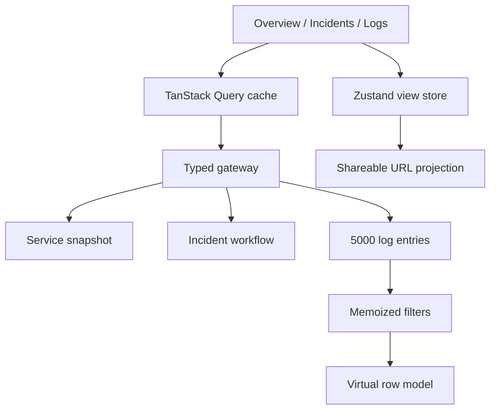
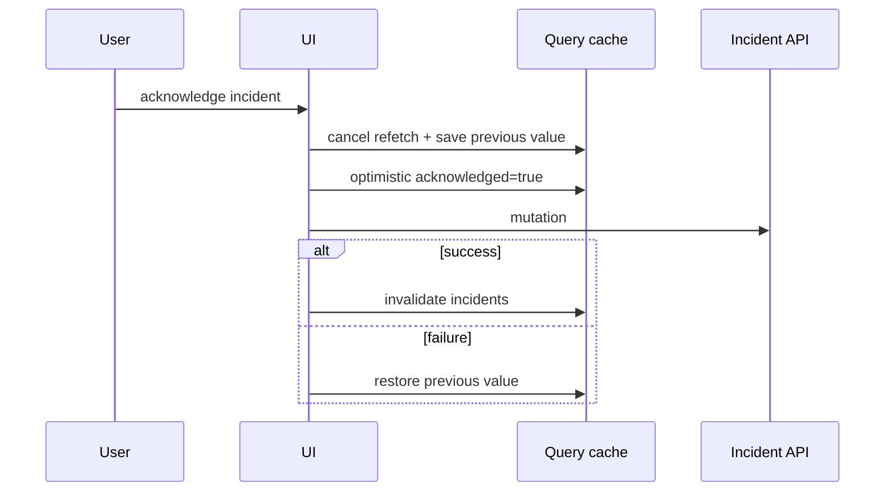

# IncidentCanvas — frontend architecture

## Цель

IncidentCanvas показывает архитектуру интерфейса, где одновременно меняются
несколько классов данных: медленные агрегаты, оперативный статус инцидента,
частый telemetry tick и большой поток логов. Главная задача — сохранить
предсказуемость состояния и отзывчивость UI.

## Слои

Компоненты не знают, синтетические данные используются или настоящий backend.
Граница находится в `lib/mock-api.ts`: функции возвращают Promise и typed DTO,
а telemetry предоставляет unsubscribe callback.

## Владение состоянием

| Состояние                             | Владелец               | Причина                                  |
| ------------------------------------- | ---------------------- | ---------------------------------------- |
| snapshot, incidents, logs             | TanStack Query         | кеширование, loading/error, invalidation |
| active view, filters, command palette | Zustand                | состояние конкретного рабочего места     |
| sorting                               | TanStack Table + React | локально для одного экземпляра таблицы   |
| filter projection                     | URL                    | deep link и воспроизводимый контекст     |

Такое разделение не превращает один глобальный store в источник всех данных и
не дублирует server-state в Zustand.

## Optimistic mutation

## Таблица v9

Подключена только используемая feature-функциональность: `rowSortingFeature` и
`createSortedRowModel`. Columns создаются типизированным `createColumnHelper`, а
`table.FlexRender` сохраняет headless-модель и семантическую HTML-таблицу.

## Виртуализация логов

Полный dataset остаётся в памяти query cache, но TanStack Virtual рассчитывает
координаты только видимого окна с overscan. Высота строки фиксирована, поэтому
scroll position вычисляется без измерения каждого элемента. Это отделяет объём
данных от количества DOM nodes.

## Подключение production backend

1. Реализовать текущий gateway поверх REST для snapshots/incidents.
2. Заменить timer telemetry на SSE или WebSocket transport.
3. Перенести фильтрацию и cursor pagination логов на сервер для миллионов строк.
4. Добавить auth boundary, tenant context и permissions.
5. Ввести schema validation входящих DTO, retry policy и correlation ID.
6. Добавить OpenTelemetry для измерения render/query latency и Web Vitals.

UI-компоненты и модель владения состоянием при этом сохраняются.
